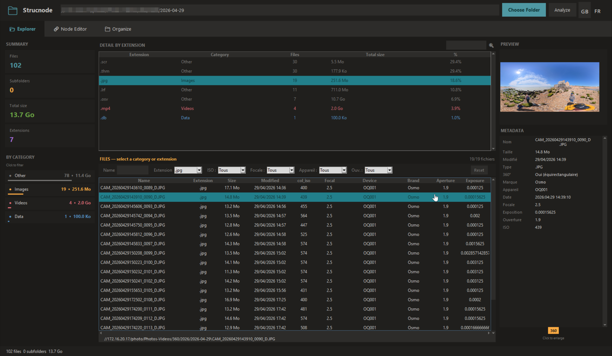
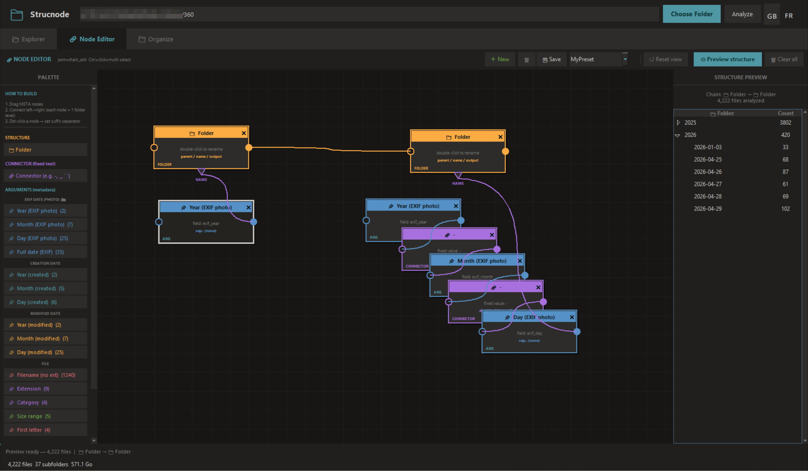
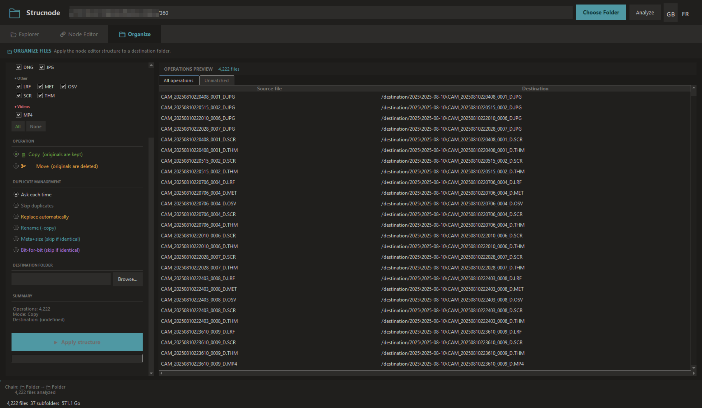

<p align="center">
  
</p>

# Strucnode


Strucnode is a desktop **Tkinter** application for analyzing folders, previewing media, extracting metadata, and building file organization structures with a visual node editor.

## Features

- Scan a folder tree and compute statistics.
- Filter files by extension and category.
- Preview images, RAW photos, videos, and 360° panoramas.
- Extract useful metadata such as EXIF date, camera model, focal length, aperture, and exposure.
- Build destination folder structures visually with a node editor.
- Simulate copy and move operations before applying them.
- Manage duplicate files with multiple strategies.
- Switch between English and French.

## Screenshots

### Explorer
Shows folder statistics, file categories, previews, and metadata inspection.



### Node Editor
Build folder structures visually with metadata nodes, connectors, and folder levels.



### Organize
Preview copy/move operations, choose a destination, and manage duplicates.



## Installation

```bash
git clone https://github.com/helmanath/strucnode.git
cd strucnode
python -m venv .venv
```

Install dependencies:

```bash
pip install -r requirements.txt
```

Run the application:

```bash
python strucnode.py
```

## Requirements

### Core

- Python 3.10+
- Tkinter
- Pillow

### Optional features

- `opencv-python` for video support.
- `rawpy` and `exifread` for RAW decoding and metadata.
- `sounddevice` for video audio playback.
- `moviepy` for audio extraction fallback.
- `ffmpeg` and `ffprobe` for robust video handling.
- `dcraw` as an optional RAW thumbnail fallback.

## Project structure

```text
strucnode/
├── strucnode.py
├── README.md
├── requirements.txt
├── pyproject.toml
├── .gitignore
├── LICENSE
└── .github/
```

## License

MIT License.
