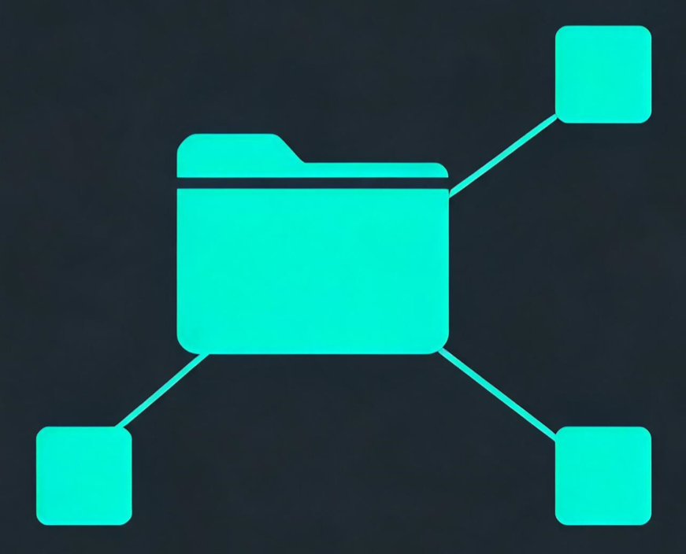
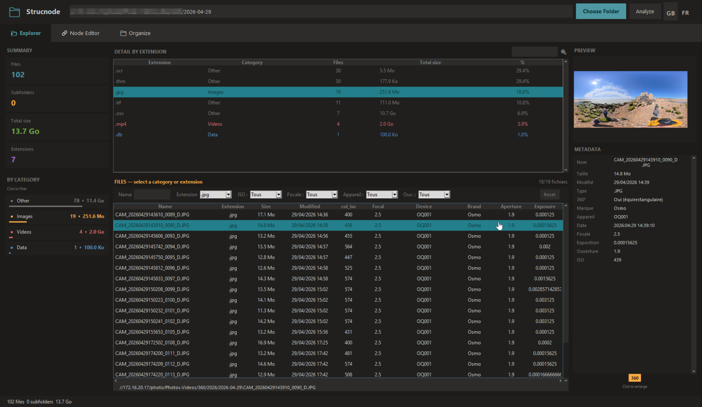
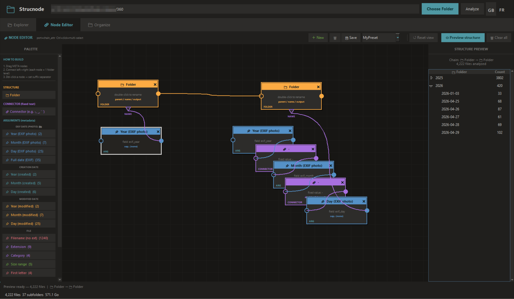
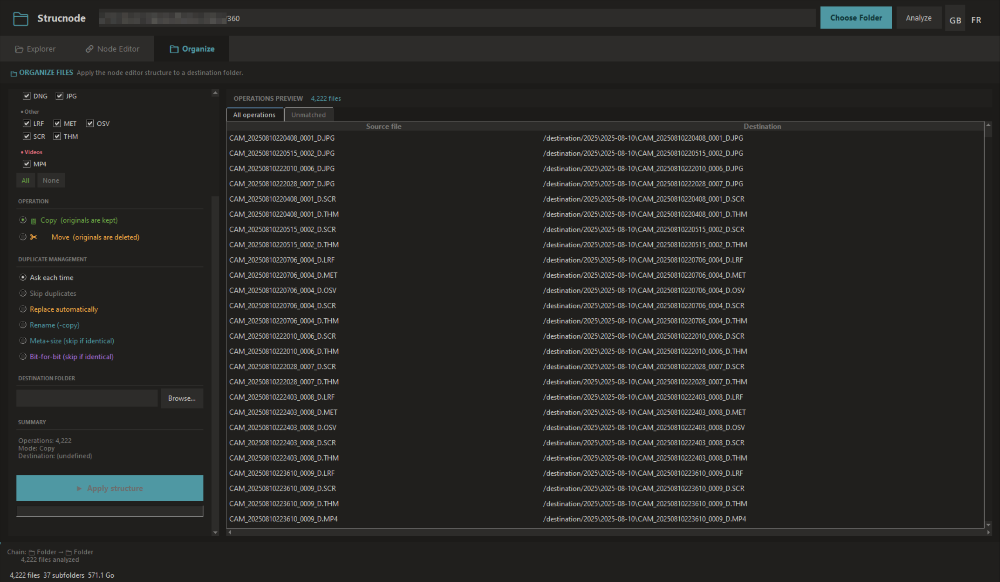

<p align="center">
  
</p>

# Strucnode


Strucnode is a desktop **Tkinter** application for analyzing folders, previewing media, extracting metadata, and building file organization structures with a visual node editor.

## Features

- Scan a folder tree and compute statistics.
- Filter files by extension and category.
- Preview images, RAW photos, videos, and 360° panoramas.
- Extract useful metadata such as EXIF date, camera model, focal length, aperture, and exposure.
- Build destination folder structures visually with a node editor.
- Simulate copy and move operations before applying them.
- Manage duplicate files with multiple strategies.
- Switch between English and French.

## Screenshots

### Explorer
Shows folder statistics, file categories, previews, and metadata inspection.



### Node Editor
Build folder structures visually with metadata nodes, connectors, and folder levels.



### Organize
Preview copy/move operations, choose a destination, and manage duplicates.



## Installation

```bash
git clone https://github.com/helmanath/strucnode.git
cd strucnode
python -m venv .venv
```

Install dependencies:

```bash
pip install -r requirements.txt
```

Run the application:

```bash
python -m strucnode
```

`python strucnode.py` still works, and `pip install -e .` adds a `strucnode`
command.

## Requirements

### Core

- Python 3.10+
- Tkinter
- Pillow

### Optional features

Install them all with `pip install -e ".[media]"`.

- `opencv-python` for video support.
- `rawpy` and `exifread` for RAW decoding and metadata.
- `sounddevice` for video audio playback.
- `moviepy` for audio extraction fallback.
- `ffmpeg` and `ffprobe` for robust video handling.
- `dcraw` as an optional RAW thumbnail fallback.

## Project structure

```text
strucnode/
├── strucnode.py             # launcher, kept so `python strucnode.py` still works
├── strucnode/
│   ├── app.py               # main window: tabs, language, scan, status bar
│   ├── config.py            # ~/.strucnode: presets, journal, settings
│   ├── theme.py             # colors and ttk styles
│   ├── i18n/                # t(), tr(), and locales/{en,fr}.json
│   ├── core/                # no Tkinter import, fully unit-tested
│   │   ├── scanner.py       # folder walk
│   │   ├── metadata.py      # EXIF
│   │   ├── fields.py        # the metadata fields a node can expose
│   │   ├── tree.py          # folder tree + path-safe names
│   │   ├── planner.py       # operations, collisions, free space
│   │   ├── executor.py      # copy/move, duplicates, journal
│   │   └── dedupe.py
│   ├── media/               # images, RAW, video, OS integration
│   └── ui/                  # explorer, organize and node editor tabs
├── tests/
└── .github/workflows/ci.yml
```

## Development

```bash
pip install -e ".[dev]"
pytest          # unit tests, no display needed
ruff check .    # lint
```

`core/` never imports Tkinter, so the scanning, metadata, tree-building and
copy/move logic is tested without a display. The UI modules are import-checked
against a small Tk stub.

### Adding or changing a translation

Edit `strucnode/i18n/locales/en.json` and `fr.json`. Bind a widget to its key
once and it follows the language for the rest of its life:

```python
from strucnode.i18n import tr

self._title = tr(tk.Label(parent, bg=BG), "explorer.summary")
```

Two rules, both enforced by `tests/test_i18n.py`:

- never use a translated string as data or as an identifier (compare against a
  key or an index, not against the text a widget happens to display);
- store dynamic text as `(key, params)` and re-render it, rather than as an
  already-formatted string.

Adding a new language is a matter of dropping a `<code>.json` next to the
others; the language buttons are built from what is in that folder.

## License

MIT License.
